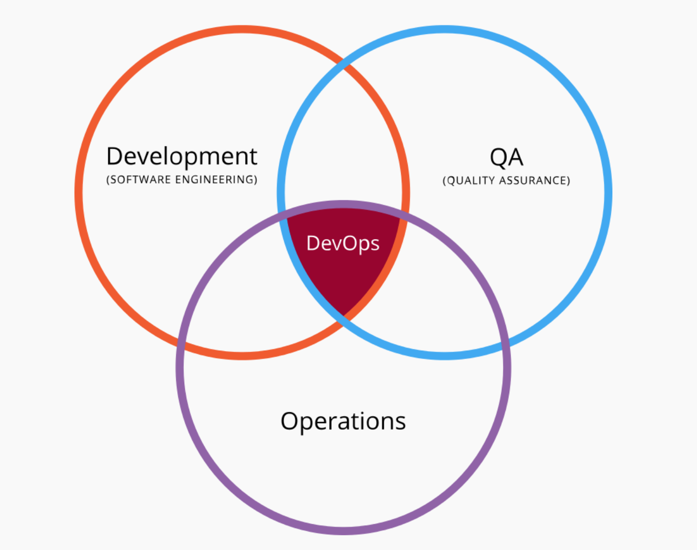
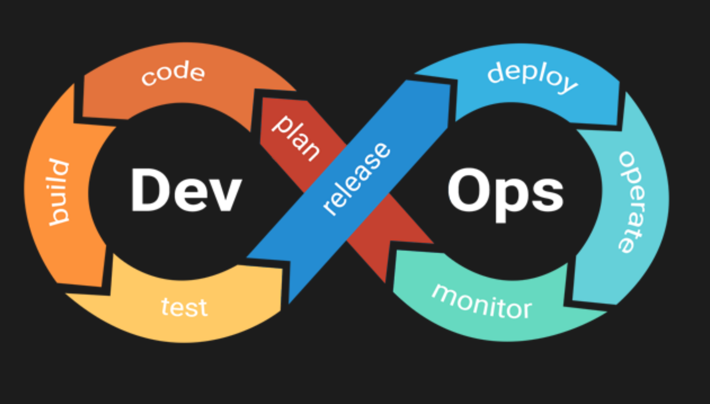
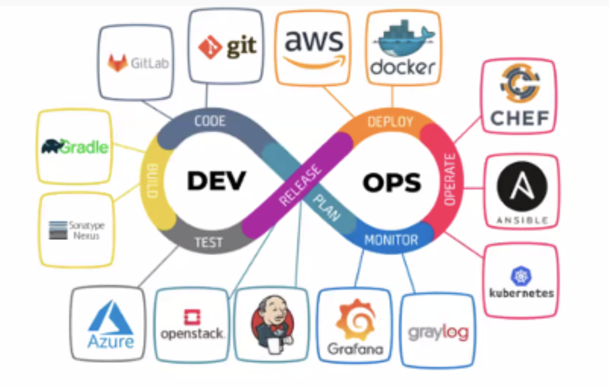

# Resumo

## Nuvem

### O que é ?

A computação na nuvem é a entrega sob demanda de poder computacional, de armazenamento, de banco de dados, de aplicações e recursos de TI por uma plataforma na internet, que segue o modelo de preço de **pay-as-you-go(pagar conforme o uso)**.

Se precisamos hospedar um programa, não utilizamos uma máquina física para isso e nem uma virtual com um sistema operacional completo, utilizamos um contêiner ou um cluster(um conjunto de contêineres) para hospedar a aplicação, sendo assim quando precisamos de mais poder de computação, adicionamos mais contêiner no cluster.

Este conceito já existe desde de **1960** conforme visto na imagem abaixo em um IBM System/360 Modelo 91.

Uma das principais vantagens desse tipo de serviço **é não ter que pagar por uma infraestrutura de início**, mas sim pagar conforme o uso e crescimento de uma aplicação. Sendo que os recursos dedicados para essa aplicação serão ajustados para atender exatamente às suas necessidades.

Utilizar a cloud é trocar a forma de gasto com software, ao invés de grandes gastos de tempos em tempos, temos gastos contínuos que nos permitem criar sistema de forma mais ágil e com menos complexidade…

### Tipos de nuvem

**Pública**: todas as aplicações rodam em um provedor que gerencia os servidores físicos de que disponibiliza o software para criar e gerenciar os recursos.

**Privada**(On Premises): é cloud criada com a infraestrutura interna de uma empresa, utiliza virtualização para realizar o provisionamento de recursos, é muito utilizada para o tratamento de dados mais sensíveis.

**Híbrida**: É a conexão de uma infraestrutura privada com a cloud pública.

### Tipos de Serviços na nuvem

**SaaS** — Software as a Service: É um serviço de software, por exemplo, o Google drive, ou então o spotify.

**PaaS** — Platform as a Service: É onde temos uma plataforma configurada pela empresa prestadora de serviço, e nós realizamos o deploy do código nessa infraestrutura.

**IaaS** — Infrastructure as a Service: É o serviço que nos provê as ferramentas necessárias para criar uma infraestrutura virtual para a nossa aplicação. Normalmente essa infraestrutura é configurada por meio de código.

## DevOps

Aplicação de práticas e conceitos que abrangem as seguintes áreas:

### Livros de Referências

* [Manual DevOps](https://www.amazon.com.br/Manual-DevOps-confiabilidade-organiza%C3%A7%C3%B5es-tecnol%C3%B3gicas/dp/8550802697)
* [O Projeto Fênix](https://www.amazon.com.br/projeto-f%C3%AAnix-comemorativa-romance-neg%C3%B3cio/dp/8550814067/ref=pd_bxgy_img_sccl_1/140-5622941-7678757?pd_rd_w=mI0B4&content-id=amzn1.sym.758f3509-df88-4265-806c-565a738dc05d&pf_rd_p=758f3509-df88-4265-806c-565a738dc05d&pf_rd_r=H179SSBX1AKWKR6F3FF4&pd_rd_wg=wVmaF&pd_rd_r=622ce983-a7f2-4f91-b9c7-1f8704893201&pd_rd_i=8550814067&psc=1)
* [O Projeto Unicórnio](https://www.amazon.com.br/Projeto-Unic%C3%B3rnio-Romance-Desenvolvedores-Disrup%C3%A7%C3%A3o/dp/6555203447/ref=pd_bxgy_img_sccl_2/140-5622941-7678757?pd_rd_w=ecOyR&content-id=amzn1.sym.758f3509-df88-4265-806c-565a738dc05d&pf_rd_p=758f3509-df88-4265-806c-565a738dc05d&pf_rd_r=4P33K28BPW2W6Z3FEBEG&pd_rd_wg=3cWo9&pd_rd_r=62759ad5-07b1-4888-9d9d-58654bf66c8c&pd_rd_i=6555203447&psc=1)

## AWS

* A **AWS** foi criada em 2006;
* Atualmente é a cloud mais popular no mercado, tendo mais de 30% de participação no mercado;
* Tem como cliente algumas das maiores empresas de tecnologia da atualidade como:
	* **Ifood**
	* **Netflix**
	* **Nubank**

* Tem serviços com algumas horas que são gratuitas, tem alguns que são gratuitos sempre, e tem outros que tem limite de cota de armazenamento.
* Ao criar um serviço o melhor é pesquisar para saber qual é a versão desse produto que está incluída no **free-tier**.

- Na AWS temos alguns serviços que fornecem poder computacional para as nossas aplicações.

- Esse poder computacional se refere a quantidade de núcleos de processamento, a quantidade de memória RAM e ao tipo de máquina a ser criada

- Na AWS o principal serviço responsável por esse provisionamento é o EC2.

- EC2 — Elastic Compute Cloud

- Existem vários tipos de Serviços que provém computação, a grande maioria deles faz uso direto do EC2 ou uso indireto.

### Instâncias

- As instâncias são as formas computacionais de mais baixo nível na AWS, nelas temos grande controle sobre como configuraremos as nossas aplicações, mas por consequência perdemos a conveniência

- Focaremos no **EC2**.

- **EC2 — Elastic Compute Cloud**

- - Existem vários tipos de Serviços que provém computação, a grande maioria deles faz uso direto do EC2 ou uso indireto 

- **EC2: Elastic Compute Cloud**

- - Normal — segura, tamanho variável

  - Pode ser escalada verticalmente, ou seja, aumento da capacidade da instância, porém é preferível o escalonamento horizontal, onde são adicionadas mais instâncias ao cluster.

  - Tipos: 

  - - Uso geral
    - Otimizadas para computação
    - Otimizadas para memória
    - Computação acelerada
    - Otimizadas para armazenamento

    
    
  - - **Recursos das instâncias**

    - - Instâncias de desempenho com capacidade de intermitência — As instâncias de desempenho com capacidade de intermitência oferecem uma linha de base de desempenho da CPU com a capacidade de intermitência acima da linha de base.
      - Várias opções de armazenamento
      - O Amazon EBS é um volume de armazenamento resiliente ao nível de bloco que pode ser associado a uma instância do Amazon EC2 única e em execução. 
      - O Amazon EBS oferece três tipos de volumes para atender da melhor forma às necessidades da carga de trabalho: uso geral (SSD), IOPS provisionadas (SSD)(Baixa latência) e magnético.
      - Redes em cluster
      - Recursos do processador Intel
